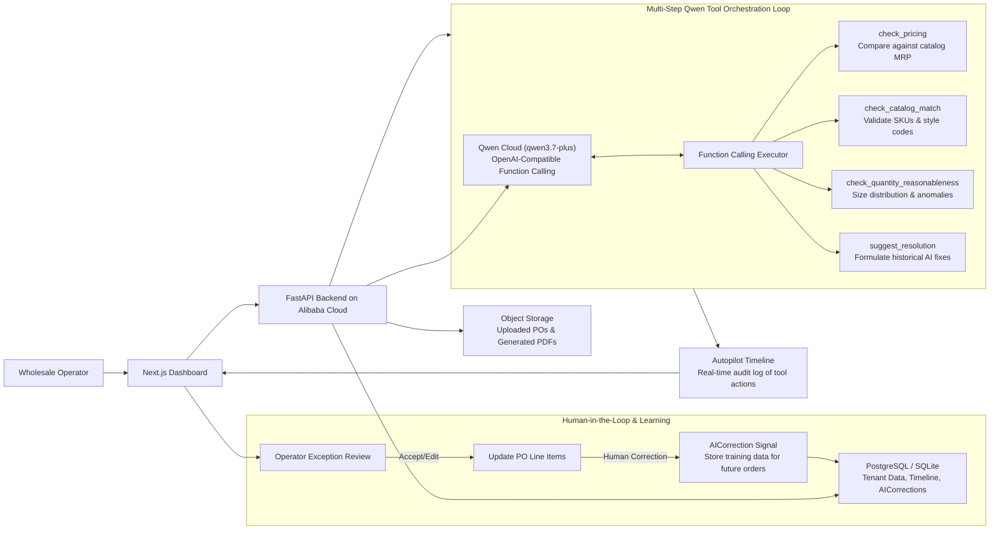

# Grada Autopilot Architecture

Grada Autopilot is a Track 4 Autopilot Agent submission for the Global AI Hackathon with Qwen Cloud.

It automates a real wholesale operations workflow: ingest a buyer purchase order, extract and normalize line items, flag risky rows, wait for human confirmation, then generate barcode stickers, a commercial invoice, and a packing list.

## System Diagram



## Agent Flow

1. Operator uploads a marketplace PO.
2. Grada queues a Qwen-powered extraction run and records the agent timeline.
3. Parser tools extract PO header data and line items from PDF/XLS/XLSX inputs.
4. Qwen PO risk reasoner reviews the parsed rows, classifies overall risk, lists critical checks, and recommends the next action.
5. Exception resolver normalizes low-risk rows and flags risky rows for review.
6. Human reviewer accepts, edits, or rejects suggested fixes.
7. Human confirmation unlocks downstream document generation.
8. Agent tools generate barcode stickers, commercial invoice, and packing list PDFs.
9. Every agent action, tool call, and human checkpoint is visible in the Autopilot timeline.

## Why This Is An Autopilot Agent

- Handles ambiguous real-world inputs instead of a toy prompt.
- Invokes external tools for parsing, review, document generation, storage, and background jobs.
- Uses Qwen Cloud for structured operational reasoning over parsed PO rows and exception summaries.
- Uses human-in-the-loop gates before commercial documents can be generated.
- Persists an audit-friendly timeline of agent actions, tool results, and human decisions.
- Can run on Alibaba Cloud with Qwen Cloud as the model provider through `AI_PROVIDER=qwen`.

## Qwen Cloud Integration Points

- AI provider configuration: `apps/api/app/core/config.py`
- Qwen/OpenAI-compatible client selection: `apps/api/app/services/ai.py`
- Qwen PO risk reasoning call: `apps/api/app/services/ai.py::AIService.assess_received_po_autopilot`
- Received PO reasoning orchestration and fallback metadata: `apps/api/app/services/received_po_reasoning.py`
- Parse-job timeline event: `agent.qwen_reasoning_completed`
- Required env:

```bash
AI_PROVIDER=qwen
QWEN_API_KEY=...
QWEN_BASE_URL=https://dashscope-intl.aliyuncs.com/compatible-mode/v1
QWEN_MODEL=qwen3.7-plus
```

## Alibaba Cloud Deployment Proof

For judging, deploy the FastAPI backend on Alibaba Cloud and include:

- a public backend health URL
- a short screen recording showing the backend running on Alibaba Cloud
- environment configuration showing `AI_PROVIDER=qwen`
- this code path showing Qwen Cloud API use: `apps/api/app/services/ai.py`
